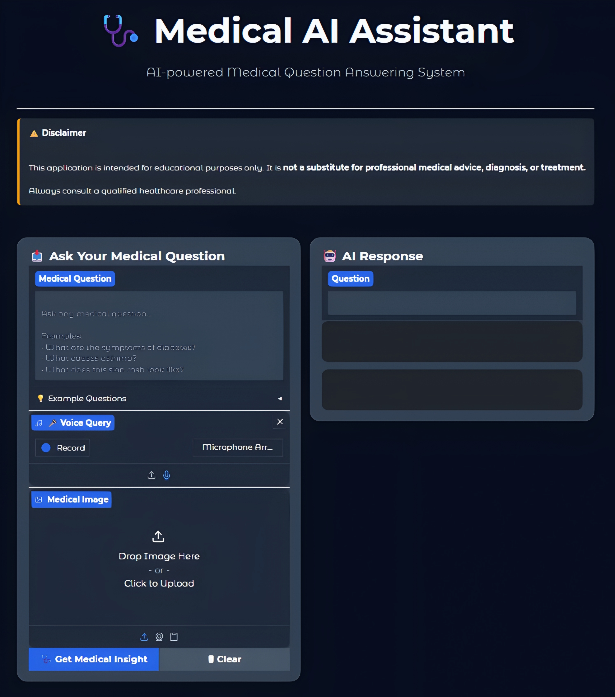
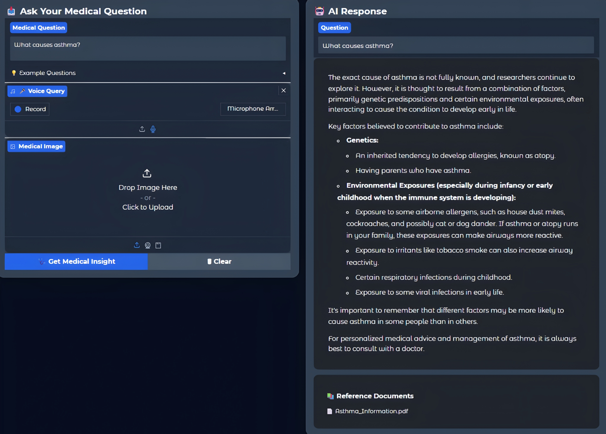
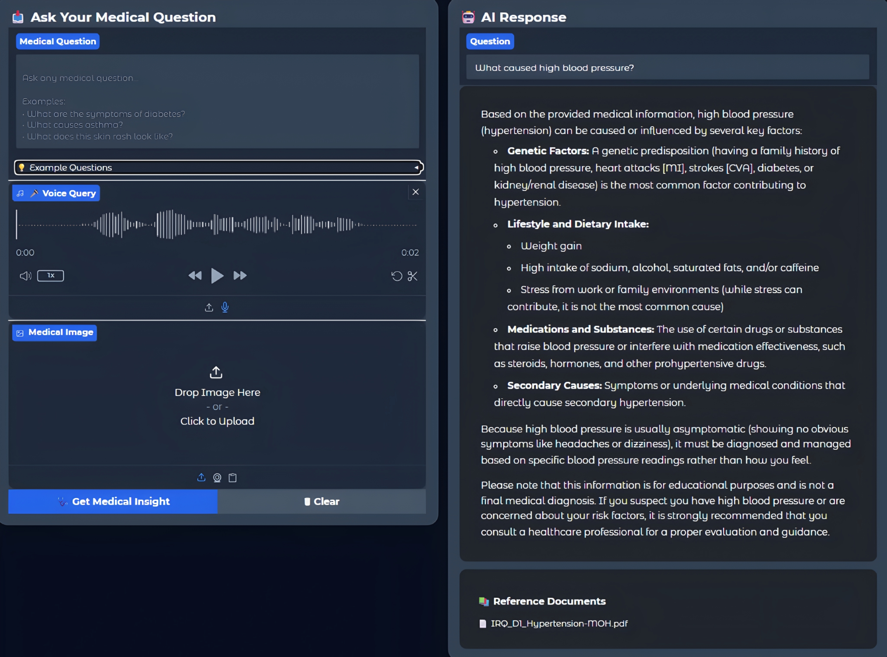
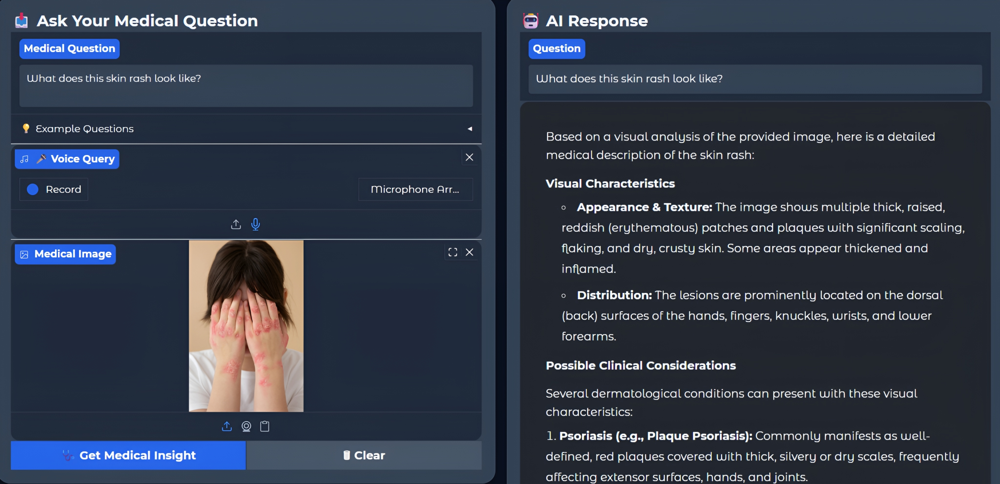
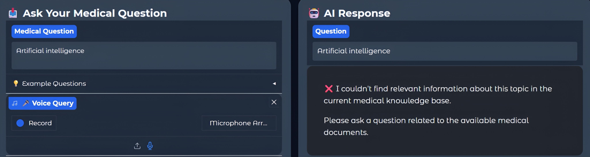

# 🏥 Medical AI Assistant

<p align="center">


</p>

An AI-powered multimodal medical assistant that combines **Speech-to-Text**, **Medical Image Analysis**, **Retrieval-Augmented Generation (RAG)**, and **Google Gemini** to provide context-aware medical insights.

Instead of relying only on an LLM, the application first retrieves relevant information from a custom medical knowledge base using semantic search and then combines that knowledge with the user's question and optional medical image to generate an informed response.

> **Disclaimer:** This project is intended for educational purposes only and should not be used as a substitute for professional medical advice, diagnosis, or treatment.

---

# 📖 Project Overview

Medical information available on the internet is often scattered, unreliable, or difficult to interpret. General-purpose AI models may also generate responses without grounding them in trusted medical documents.

This project addresses that challenge by integrating Retrieval-Augmented Generation (RAG) with a multimodal AI pipeline. Instead of answering solely from the language model's knowledge, the assistant retrieves relevant information from a custom medical document collection before generating a response.

The application supports:

- 🎤 Voice-based medical questions using Whisper
- 🖼️ Medical image understanding using Gemini Vision
- 📚 Retrieval of relevant medical knowledge using ChromaDB
- 🤖 AI-generated responses grounded in retrieved documents
- 📄 Source attribution for retrieved medical documents
- ⚠️ Detection of questions outside the available knowledge base

---

# ✨ Key Highlights

- 🎤 Speech-to-Text using OpenAI Whisper
- 🖼️ Medical image analysis with Gemini Vision
- 📚 Retrieval-Augmented Generation (RAG)
- 🔍 Semantic search using Sentence Transformers
- 🗄️ ChromaDB vector database for document retrieval
- 🤖 Context-aware responses powered by Gemini 2.5 Flash
- 📄 Displays source documents used for answer generation
- ⚠️ Intelligent relevance filtering for unsupported queries
- 💻 Interactive web interface built with Gradio

---

# 🚀 Features

## 🎤 Speech-to-Text

- Converts voice recordings into text using OpenAI Whisper
- Supports both microphone recording and audio file uploads
- Automatically uses the transcribed text as the user's question

---

## 🖼️ Medical Image Analysis

- Accepts optional medical images
- Uses Gemini Vision to analyze visible symptoms and conditions
- Combines image understanding with retrieved medical knowledge

---

## 📚 Retrieval-Augmented Generation (RAG)

- Retrieves relevant medical information from a custom knowledge base
- Uses semantic similarity search instead of keyword matching
- Grounds responses using retrieved document context

---

## 🗄️ Vector Database

- Stores document embeddings using ChromaDB
- Enables fast and efficient semantic retrieval
- Supports scalable knowledge base expansion

---

## 🤖 AI Response Generation

The final response is generated using:

- User question
- Speech-to-text transcription (if applicable)
- Medical image (optional)
- Retrieved medical context

This helps generate responses that are more relevant and grounded than using an LLM alone.

---

## ⚠️ Robust Error Handling

The application gracefully handles:

- Empty user input
- Missing speech transcription
- Invalid image uploads
- Gemini API failures
- Retrieval failures
- Unsupported medical topics outside the knowledge base

---

# 🏗️ System Architecture

```text
                           User Input
                               │
                ┌──────────────┴──────────────┐
                │                             │
         🎤 Voice Query                 ⌨️ Text Query
                │                             │
                ▼                             │
        OpenAI Whisper                        │
                │                             │
                └──────────────┬──────────────┘
                               │
                               ▼
                      User Medical Question
                               │
                               ▼
                  ChromaDB + Semantic Search
                               │
                               ▼
                  Relevant Medical Documents
                               │
                ┌──────────────┴──────────────┐
                │                             │
        🖼️ Medical Image              Retrieved Context
                │                             │
                ▼                             ▼
                 Google Gemini 2.5 Flash Vision
                               │
                               ▼
                  AI-Powered Medical Response
                               │
                               ▼
                  📄 Sources + Medical Answer
```

---

# 🛠️ Tech Stack

| Category | Technologies |
|-----------|--------------|
| Programming Language | Python 3.10+ |
| Frontend | Gradio |
| Speech-to-Text | OpenAI Whisper |
| Large Language Model | Google Gemini 2.5 Flash |
| Image Understanding | Gemini Vision |
| RAG Framework | LangChain |
| Vector Database | ChromaDB |
| Embedding Model | Sentence Transformers |
| PDF Processing | PyPDF |
| Environment Management | Python Virtual Environment |

---

# 📂 Project Structure

```text
medical_ai_assistant/
│
├── app.py
│
├── speech/
│   └── speech_to_text.py
│
├── llm/
│   └── gemini_vision.py
│
├── rag/
│   ├── ingest.py
│   ├── retriever.py
│   └── rag_chain.py
│
├── pipeline/
│   └── final_medical_pipeline.py
│
├── documents/
│   └── Medical Knowledge Base (PDFs)
│
├── chroma_db/
│
├── uploads/
│
├── screenshots/
│
├── requirements.txt
├── .env
└── README.md
```

---

# ⚙️ Installation

### 1️⃣ Clone the Repository

```bash
git clone https://github.com/your-username/medical_ai_assistant.git
cd medical_ai_assistant
```

---

### 2️⃣ Create a Virtual Environment

```bash
python -m venv venv
```

---

### 3️⃣ Activate the Environment

**Windows**

```bash
venv\Scripts\activate
```

**Linux / macOS**

```bash
source venv/bin/activate
```

---

### 4️⃣ Install Dependencies

```bash
pip install -r requirements.txt
```

---

### 5️⃣ Configure Environment Variables

Create a `.env` file:

```env
GEMINI_API_KEY=YOUR_API_KEY
```

---

### 6️⃣ Install FFmpeg

Whisper requires FFmpeg.

Verify installation:

```bash
ffmpeg -version
```

---

# ▶️ Running the Application

```bash
python app.py
```

Open your browser and visit:

```text
http://127.0.0.1:7860
```

---

# 📋 Usage

1. Launch the application.
2. Type a medical question or record/upload your voice.
3. Optionally upload a medical image.
4. Click **Analyze**.
5. The assistant retrieves relevant medical information from the knowledge base.
6. Gemini generates a context-aware medical response.
7. The retrieved source documents are displayed along with the response.

---

# 📸 Application Screenshots

## 🏠 Home Screen



---

## 🤖 AI-Generated Medical Response



---

## 🎤 Voice Query 



---

## 🖼️ Medical Image Analysis



---

## ❌ Unsupported Query Detection



---

# 🚀 Future Improvements

Some features planned for future versions include:

- 💬 Multi-turn conversational memory
- 🌍 Multi-language support
- 📑 Medical report summarization
- 💊 Prescription OCR and analysis
- ☁️ Cloud deployment
- 🔐 User authentication
- 📊 Medical dashboard and analytics
- 📱 Mobile-friendly interface

---

# 🤝 Contributing

Contributions, suggestions, and improvements are welcome.

If you'd like to contribute:

1. Fork this repository.
2. Create a new feature branch.
3. Commit your changes.
4. Submit a Pull Request.

---

# 📜 License

This project is licensed under the MIT License. See the LICENSE file for details.
---

# 👨‍💻 Author

**Shubham Rajput**

B.Tech – Artificial Intelligence & Data Science

Interested in:

- Generative AI
- Machine Learning
- Retrieval-Augmented Generation (RAG)
- Large Language Models (LLMs)
- AI Application Development

If you found this project useful, consider giving it a ⭐ on GitHub.
