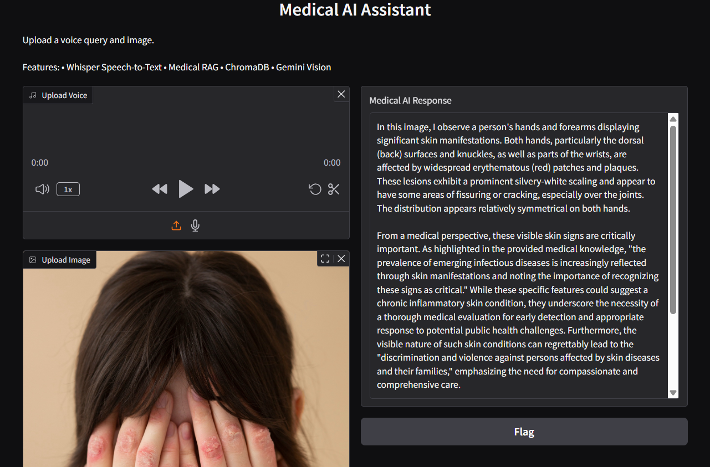
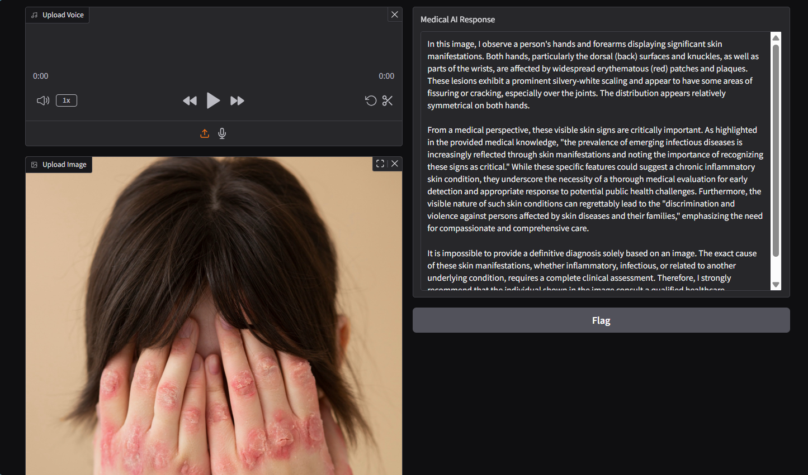

# 🏥 Medical AI Assistant

A multimodal AI-powered medical assistant that combines **Speech-to-Text, Image Analysis, Retrieval-Augmented Generation (RAG), and Large Language Models** to provide medical insights from voice queries and medical images.

## 🚀 Features

### 🎤 Speech-to-Text

* Converts user voice queries into text using OpenAI Whisper.
* Supports audio upload and microphone recording.

### 🖼️ Medical Image Analysis

* Analyzes medical images using Gemini Vision.
* Generates detailed observations about visible symptoms and conditions.

### 📚 Retrieval-Augmented Generation (RAG)

* Retrieves relevant medical knowledge from custom medical documents.
* Uses vector embeddings and semantic search.

### 🗄️ ChromaDB Vector Database

* Stores document embeddings for efficient retrieval.
* Enables context-aware medical responses.

### 🤖 AI-Powered Medical Responses

* Combines:

  * User question
  * Medical image
  * Retrieved medical knowledge
* Produces a comprehensive medical explanation.

### ⚠️ Error Handling

* Missing audio validation
* Missing image validation
* Empty speech detection
* Retriever failure handling
* Gemini API failure handling
* Invalid image handling

---

## 🏗️ System Architecture

User Audio
↓
Whisper Speech-to-Text
↓
User Question
↓
RAG Retriever (ChromaDB)
↓
Relevant Medical Context

User Image
↓
Gemini Vision

Question + Image + Medical Context
↓
Gemini 2.5 Flash
↓
Final Medical Response

---

## 🛠️ Tech Stack

### AI & Machine Learning

* Google Gemini 2.5 Flash
* OpenAI Whisper
* Sentence Transformers

### RAG Components

* ChromaDB
* LangChain Text Splitter
* PyPDF

### Frontend

* Gradio

### Backend

* Python

---

## 📂 Project Structure

medical_ai_assistant/

├── app.py

├── speech/

│ └── speech_to_text.py

├── rag/

│ ├── ingest.py

│ ├── retriever.py

│ └── rag_chain.py

├── llm/

│ └── gemini_vision.py

├── pipeline/

│ └── final_medical_pipeline.py

├── documents/

│ └── Medical PDFs

├── chroma_db/

├── uploads/

├── .env

├── requirements.txt

└── README.md

---

## ⚙️ Installation

### 1. Clone Repository

```bash
git clone <repository-url>
cd medical_ai_assistant
```

### 2. Create Virtual Environment

```bash
python -m venv venv
```

### 3. Activate Virtual Environment

Windows:

```bash
venv\Scripts\activate
```

### 4. Install Dependencies

```bash
pip install -r requirements.txt
```

### 5. Configure Environment Variables

Create a `.env` file:

```env
GEMINI_API_KEY=YOUR_API_KEY
```

### 6. Install FFmpeg

Required for Whisper Speech-to-Text.

Verify installation:

```bash
ffmpeg -version
```

---

## ▶️ Running the Application

```bash
python app.py
```

Open:

```text
http://127.0.0.1:7860
```

---

## Application Screenshots

### Home Screen




### Generated Medical Response




---


## 📋 Usage

1. Upload or record a voice query.
2. Upload a medical image.
3. Click Submit.
4. Receive an AI-generated medical explanation.


---

## 👨‍💻 Author

Shubham Rajput

B.Tech Artificial Intelligence & Data Science

Generative AI | Machine Learning | Data Science
